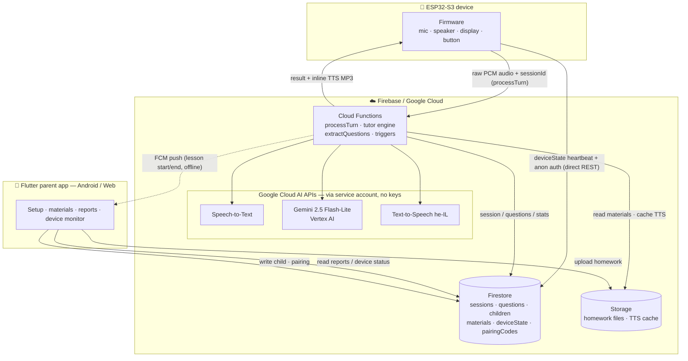

# System Architecture — Pip LLM Tutor

End-to-end data flow across the three parts of the system. The ESP32 device talks
only to Firebase (never directly to the AI APIs); the Cloud Functions call Google
Cloud AI services using the **project service account (ADC)** — there are no LLM
API keys stored anywhere.

## Legend

- **Device → Cloud Functions:** one `processTurn` HTTPS call per answer — uploads
  the raw PCM audio, receives the graded feedback + the spoken MP3 inline
  (see [PERFORMANCE_EVALUATION.md](PERFORMANCE_EVALUATION.md)).
- **Device → Firestore (direct):** the device also writes its `deviceState`
  heartbeat and creates sessions over the Firestore REST API (anonymous auth), so
  the app sees it live.
- **Cloud Functions → AI:** STT transcribes, Gemini (Vertex AI) grades + generates
  feedback/questions, TTS synthesizes speech — all with the project service
  account, **no API keys**.
- **App ↔ Firestore/Storage:** the parent app reads reports/device status and
  writes children, pairing and uploaded materials; homework files go to Storage.
- **FCM:** best-effort push notifications (lesson start/end, device offline).
