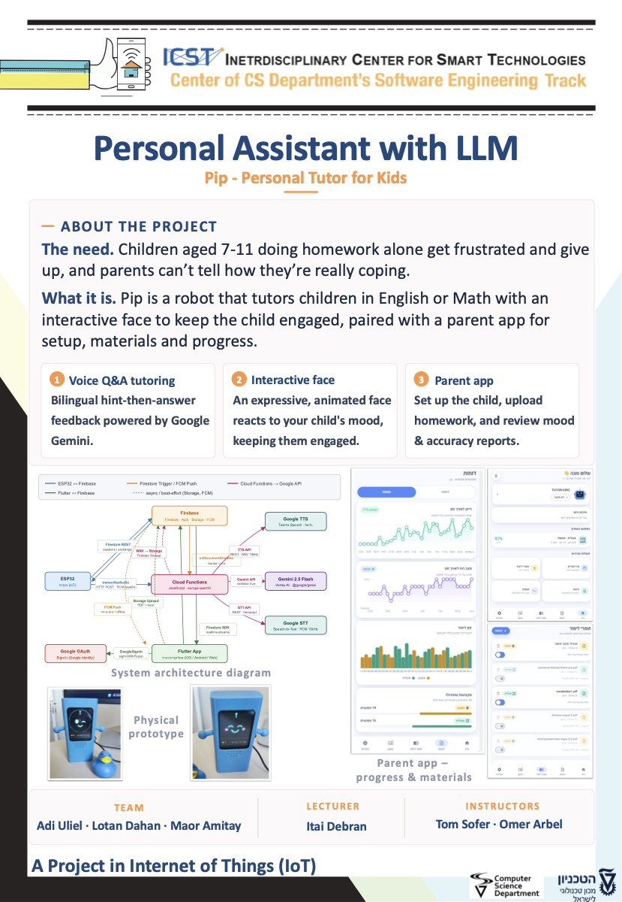

# Pip — Personal Tutor for Kids | Project by: Adi Uliel, Lotan Dahan & Maor Amitay

## Details about the project

Pip is a robot that tutors children aged 7–11 in English or Math by voice
(powered by Google Gemini), with an animated face that keeps the child engaged.
A companion Flutter parent app is used for setup, homework materials and
progress reports.

Live web app: https://llm-tutor-d721e.web.app

**How to operate the device** (pairing, daily use, error messages, calibration):
see [Documentation/USAGE.md](Documentation/USAGE.md).

## Folder description :
* **ESP32**: source code for the esp side (firmware) — `homework_assistant/` is the main sketch, plus the modified TFT_eSPI library.
* **flutter_app**: Dart code for our Flutter parent app (Android / Web).
* **firebase**: Cloud side — Cloud Functions (session engine, Gemini grading, STT/TTS proxies), Firestore/Storage rules and indexes.
* **Documentation**: usage instructions (operating, error messages, calibration), hardware documentation + connection diagram, integration guide, cloud/LLM interface, dependencies, latency measurements, [performance evaluation](Documentation/PERFORMANCE_EVALUATION.md), [face state machine](Documentation/FACE_STATE_MACHINE.md), [statistics catalog](Documentation/STATISTICS.md).
* **Unit Tests**: tests for individual hardware components (button, display+touch, microphone, speaker, firmware upload).
* **Parameters**: description of all hard-coded parameters and where to change them in the code.
* **Assets**: project poster + 3D-print (STL) files of Pip's enclosure.
* **pip_face**: standalone Arduino library for the animated on-device face (also mirrored into the main sketch).

## Hardware used in this project (+ quantities):
| Component | Qty | Notes |
|---|---|---|
| LCDWIKI 2.8" ESP32-S3 Display board (ES3C28P/ES3N28P) | 1 | Integrates the ILI9341 240×320 touch display (FT6336G), ES8311 audio codec + onboard microphone, FM8002E speaker amp, WS2812 RGB LED and a micro-SD slot |
| Speaker (wired to the board's amp output) | 1 | |
| Push-to-talk push button | 1 | Wired between IO2 and IO3 on the expansion header |
| micro-SD card | 1 | TTS audio cache |
| USB-C cable (power + flashing) | 1 | |
| 3D-printed enclosure (main body + rear cover) | 1 | STL files in [Assets/3D](Assets/3D) |

## ESP32 SDK version used in this project: 
* ESP32 by Espressif - version 2.0.17

## Arduino/ESP32 libraries used in this project:
* ArduinoJson by Benoit Blanchon - version 7.x
* TFT_eSPI by Bodmer - version 2.5.43 (modified for this board)
* pip_face (this repo) - animated on-device face

> Full dependency list (firmware, Flutter app, Cloud Functions) and the modified
> TFT_eSPI setup are documented in [Documentation/DEPENDENCIES.md](Documentation/DEPENDENCIES.md).

## Secrets setup (required to build the firmware):
Real credentials are **not** committed. Copy
[`ESP32/homework_assistant/secrets_template.h`](ESP32/homework_assistant/secrets_template.h)
to `ESP32/homework_assistant/secrets.h` and fill in your WiFi credentials and
Firebase project details (the real `secrets.h` is gitignored). The filled-in
file is available from the team on request.

## Connection diagram:
Most of the hardware is integrated on the LCDWIKI ESP32-S3 board — the only
external wiring is the push-to-talk button (IO2↔IO3) and the speaker.

* [Full ESP32-S3 Hardware Documentation (interactive)](Documentation/Hardware%20Documentation/index.html) ([PDF](Documentation/Hardware%20Documentation/Hardware%20Documentation.pdf))
* [System architecture (device ↔ Firebase ↔ Google APIs)](Documentation/ARCHITECTURE.md) — full data-flow diagram

## Project Poster:

([PDF version](Assets/pip_poster.pdf))

This project is part of ICST - The Interdisciplinary Center for Smart Technologies, Taub Faculty of Computer Science, Technion
https://icst.cs.technion.ac.il/
